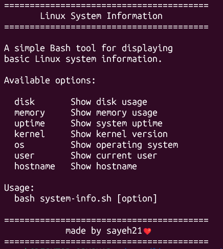

# 🐧 Linux System Info

A simple, lightweight Bash CLI tool for displaying essential Linux system information — right from your terminal, no dependencies required.


---

## ✨ Features

- 👤 User information
- 🖥️ Hostname
- 🧩 Operating system
- ⚙️ Kernel version
- 💾 Disk usage
- 🧠 Memory usage
- ⏱️ System uptime
- 🚩 Command-line options for targeted output

---

## 📦 Requirements

- Linux
- Bash

---

## 🚀 Usage

Make the script executable:

```bash
chmod +x system-info.sh
```

Run it with no arguments to see the full report:

```bash
./system-info.sh
```

Or pass an option to view a specific piece of information:

```bash
./system-info.sh disk
./system-info.sh memory
./system-info.sh hostname
```

### Available Options

| Option     | Description              |
|------------|---------------------------|
| `disk`     | Show disk usage           |
| `memory`   | Show memory usage         |
| `uptime`   | Show system uptime        |
| `kernel`   | Show kernel version       |
| `os`       | Show operating system     |
| `user`     | Show current user         |
| `hostname` | Show hostname             |

---

## 🖼️ Screenshot



---

## 🛠️ Technologies

- Bash
- Linux
- Git & GitHub

---

## 📚 What I Learned

Through building this project, I practiced:

- Bash scripting fundamentals
- Variables and command substitution
- Handling command-line arguments
- Conditional statements
- Pipes and combining commands
- File permissions
- Git and GitHub workflow

---

## 📄 License

This project is open source and available under the [MIT License](LICENSE).
